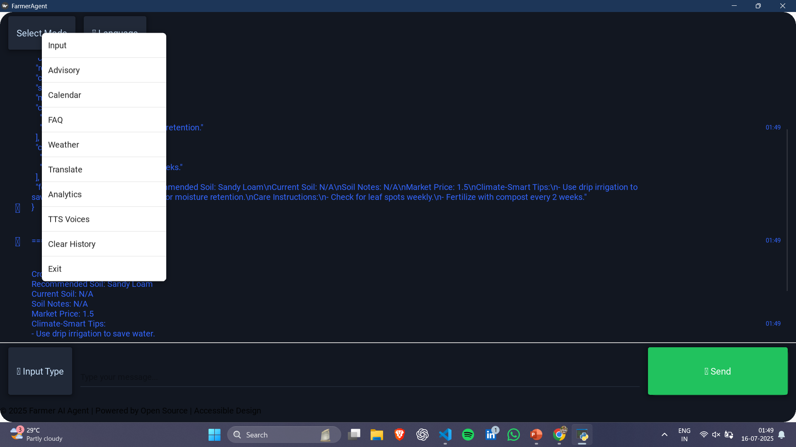

# Farmer AI Agent

**An offline-first, AI-powered agricultural assistant designed to provide Indian farmers with actionable advice, reminders, and tools to improve crop management and decision-making.**

The Farmer AI Agent is a comprehensive solution that combines local data, machine learning models, and an intuitive user interface to address the daily challenges faced by farmers. It operates primarily offline, with optional online features for enhanced, real-time data.


---

## ✨ Core Features

The project is built on a modular architecture, with distinct components for each key function:

*   **🧑‍🌾 Personalized Crop Advisory:** Get tailored advice for specific crops (e.g., Tomato, Rice, Wheat). The agent considers soil type and provides recommendations on best practices, climate-smart tips, and care instructions using local data.

*   **🌿 Plant Disease Identification (CV):** Upload an image of a plant leaf, and the agent will use a computer vision model (via Roboflow) to identify potential diseases. It then leverages a local LLM to provide practical solutions and medicine recommendations.

*   **☀️ Smart Weather Forecasting:**
    *   **Online:** Fetches a 7-day forecast using the OpenWeatherMap API, detecting the user's location automatically.
    *   **Offline:** Falls back to seasonal weather patterns if offline.
    *   **LLM-Powered Tips:** Generates practical farming tips (e.g., for irrigation, disease prevention) based on the weekly forecast.

*   **🗣️ Advanced NLP Suite (Offline):**
    *   **Speech-to-Text:** Transcribe voice commands and queries from a microphone or audio file using OpenAI's Whisper model, with support for major Indian languages.
    *   **Text-to-Speech:** Reads out responses and guidance using the system's installed voices.
    *   **Offline Translation:** Translate text between English and several regional Indian languages (Hindi, Tamil, Telugu, Kannada, Malayalam) using MarianMT and IndicTrans2 models.

*   **❓ FAQ & Guidance:** Ask questions in natural language. The agent uses a local LLM (if available) or a static FAQ database to provide answers on a wide range of farming topics.

*   **📅 Crop Calendar & Reminders:**
    *   View detailed activity schedules for various crops.
    *   Set one-time or recurring reminders for crucial farming tasks like fertilizing, irrigating, and harvesting.
    *   Check the next upcoming activity for a specific crop.

*   **📊 User Profiles & Analytics:**
    *   Supports multiple user profiles to keep a history of queries and advice.
    *   Analyzes interaction data to identify crop trends and measure the effectiveness of the advice provided.

*   **💻 Dual Interfaces:**
    *   **Graphical User Interface (GUI):** A modern, chat-based interface built with Kivy, featuring interactive menus, image uploads, and multi-language support.
    *   **Command-Line Interface (CLI):** A lightweight, menu-driven interface for users who prefer the terminal.

---

## 🛠️ Technology Stack

*   **Backend:** Python
*   **GUI:** Kivy
*   **Machine Learning & NLP:**
    *   `transformers` (Hugging Face) for offline translation.
    *   `openai-whisper` for speech-to-text.
    *   `inference-sdk` for Roboflow computer vision.
    *   `pyttsx3` for text-to-speech.
*   **Local LLM Integration:** Ollama (supports models like Llama 3, Mistral).
*   **Data Handling:** JSON for local databases and configuration.

---

## 🏗️ Architecture

The project follows a clean, modular structure that separates core logic from the user interface.

*   `farmer_agent/`: Contains all the core backend logic.
    *   `advisory/`: Generates crop advice.
    *   `data/`: Holds all offline data files (FAQs, crop calendars, user history, etc.).
    *   `nlp/`: Manages all Natural Language Processing tasks (STT, TTS, CV, Translate).
    *   `utils/`: Helper functions for file handling, environment loading, and accessibility.
    *   `config/`: Configuration files like crop definitions.
*   `main.py`: The entry point for the Command-Line Interface (CLI).
*   `test_kivy.py`: The entry point for the Kivy Graphical User Interface (GUI).
*   `data/`: This directory is crucial as it stores the "brain" of the agent in an offline context.

This offline-first approach ensures that the agent remains functional even without an internet connection, with online services acting as an enhancement.

---

## 🚀 Getting Started

Follow these steps to set up and run the Farmer AI Agent on your local machine.

### 1. Prerequisites

*   Python 3.8+
*   Git
*   (Optional but Recommended) Ollama for running a local LLM. After installing, pull a model:
    ```sh
    ollama pull llama3:8b
    ```

### 2. Clone the Repository

```sh
git clone <your-repository-url>
cd farmer_ai_agent
```

### 3. Install Dependencies

It is recommended to use a virtual environment.

```sh
python -m venv venv
source venv/bin/activate  # On Windows, use `venv\Scripts\activate`
```

Install the required packages. Note that `torch` and `pyaudio` may have system-specific installation steps.

```sh
# First, install PyTorch from the official site: https://pytorch.org/get-started/locally/
# Example for CPU:
pip install torch torchvision torchaudio

# Then install the rest of the requirements
pip install kivy openai-whisper pyttsx3 requests transformers inference-sdk sentencepiece

# For microphone input
pip install pyaudio
```

### 4. Configure Environment Variables

Create a file named `env.local` in the project root directory. This file is used to store API keys securely.

```
# env.local

# For real-time weather forecasts (optional)
OPENWEATHER_API_KEY=your_openweathermap_api_key
```

### 5. Run the Application

You can run either the GUI or the CLI.

**To run the Kivy GUI:**

```sh
python test_kivy.py
```

**To run the CLI:**

```sh
python farmer_agent/main.py
```

---

## ⚙️ Configuration

The agent's knowledge base is stored in JSON files within the `farmer_agent/data/` and `farmer_agent/config/` directories. You can customize and expand the agent's capabilities by editing these files:

*   `farmer_agent/config/crops.json`: Add or modify crop-specific data, care instructions, and tips.
*   `farmer_agent/data/faq.json`: Expand the FAQ database with more questions and answers.
*   `farmer_agent/data/crop_calendar.json`: Define or update crop schedules.
*   `farmer_agent/data/soil_data.json`: Add information about different soil types.
*   `farmer_agent/data/market_prices.json`: Update market price information.

---

## 🤝 Contributing

Contributions are welcome! If you have an idea for a new feature or have found a bug, please open an issue to discuss it first.

1.  Fork the repository.
2.  Create a new branch (`git checkout -b feature/YourFeature`).
3.  Make your changes.
4.  Commit your changes (`git commit -m 'Add some feature'`).
5.  Push to the branch (`git push origin feature/YourFeature`).
6.  Open a Pull Request.

---

## 📜 License

This project is licensed under the MIT License. See the `LICENSE` file for details.